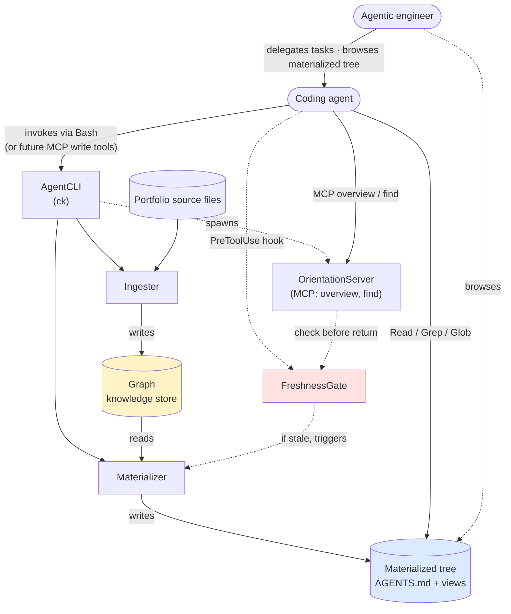

# Architecture — Context Kernel

The structural map of how Context Kernel is decomposed and how the parts interact. Read with [THEORY.md](./THEORY.md) (the *why*) and [CONTEXT.md](./CONTEXT.md) (the language).

Produced by `/grill-architecture` on 2026-05-23.

## 1. Design Tenets

The rules every module decision must obey. Numbered so later sections can cite them.

1. **Modules hide one decision likely to change.** (Parnas information hiding.) Each module's interface hides exactly one Parnas-secret — graph backend, summarization model, embedding model, materialization policy, MCP transport, or entity-resolution policy. If a module hides two unrelated decisions, split it.

2. **Work belongs in materialization, not query time.** (Implements `THEORY.md` invariant 3.) If a capability seems to need runtime synthesis (live LLM call, on-the-fly graph traversal in a request handler), the answer is to materialize a new pre-built view, not to add the runtime path. Materialization is allowed to be slow; queries must be cheap.

3. **No stateful service.** (Implements `THEORY.md` invariant 3.) Components that serve queries (today: OrientationServer) are pure functions of on-disk state — no background daemon, no in-memory cache across requests, no session affinity. Restart-safe by construction.

4. **Mutation lands at the graph; never at materialized files.** (Implements `THEORY.md` invariant 1.) Every write path goes graph-first, then materializes downward. The Materializer is the only writer to the materialized tree. No code path edits `AGENTS.md` or a view file in place. Future MCP write tools obey the same rule.

5. **Define errors out of existence at the read boundary.** (FreshnessGate is the template; implements `THEORY.md` invariant 2.) When a class of bug exists ("agent reads a stale chunk", "summary is for an older graph commit"), the architectural answer is a gate that makes the bad state structurally impossible at the boundary — not a detect-and-recover code path that someone has to remember to write.

## 1.1 Settled Tradeoffs

Decisions that already happened, recorded inline so they aren't relitigated.

1. **LightRAG** (HKUDS) as the Graph backend, over Microsoft GraphRAG (no first-class incremental updates), fast-graphrag (functionally dormant since mid-2025, key bugs unfixed in our hot paths), and Graphiti (would force Neo4j 5.26+ as a hard infra dependency). *Reason:* actively maintained, first-class incremental upsert, official Ollama path, pluggable storage. **Validation required before forking:** run the LightRAG quickstart against a representative portfolio slice on the 7900 XTX to confirm 32B-class model performance is acceptable in 24GB VRAM.

2. **Files-as-primary-interface** over a service API or query DSL. *Reason:* `Read`/`Grep`/`Glob` is universal across coding agents; the filesystem already gives us a namespace and the altitude axis. The MCP server is a *narrow orientation aid*, not a peer interface — every question MCP answers, a file could too.

3. **Pull-based JIT regeneration via FreshnessGate** over push-based watcher. See [ADR-0003](./docs/adr/0003-pull-based-jit-regeneration.md). *Reason:* "errors out of existence" — there is no class of bug where the agent reads a stale chunk, because the gate triggers regeneration before any read returns.

4. **Agent-as-operator** over human-as-operator. *Reason:* in practice, the agentic engineer delegates tasks and browses materialized output; the coding agent invokes `ck` (via Bash today; via MCP write tools later, per invariant 1). Inverts the original `docs/design.md` framing that said `ck` is never invoked by the agent. *(ADR candidate — Pass 4.)*

## 2. Module Model

The implementation-neutral module contracts.

### 2.1 Graph

The knowledge store and source of truth (per `THEORY.md` invariant 1). Holds entities, relationships, and per-scope summaries derived from the portfolio's source files. The only mutable state in Context Kernel; everything else is derivable. v1 backend: LightRAG with pluggable storage (NetworkX default; Neo4j / Postgres / Milvus available without code changes). Wrapped behind a thin `KnowledgeStore` protocol so the backend can change without rippling through callers.

| Upstream req | THEORY.md invariant 1 (source of truth); invariant 4 (content-addressed) |
|---|---|
| **Contract** | this file §2.1 |
| **Owns** | LightRAG backend choice; pluggable storage adapter; `KnowledgeStore` protocol shape (entity / relationship / summary types); content-addressing scheme for derived artifacts in `.context-kernel/{embeddings,summaries}/` |
| **Outputs** | Read APIs (entity lookup, neighbor traversal, summary retrieval, embedding retrieval); write API used only by Ingester; an opaque `graph_commit` hash that downstream modules embed in freshness headers |
| **Does not own** | Generic graph query language at the protocol level (the API is shape-specific, not "give me a Cypher query endpoint"); stable entity IDs across re-ingests (entity resolution may regenerate IDs — only `graph_commit` is a stable handle to a state-in-time); cross-project entity unification (per non-goal 2; deferred behind EntityResolver, §6); concurrency semantics beyond what the storage backend provides (caller must not assume serializable isolation across `ck ingest` invocations) |

### 2.2 Ingester

Reads portfolio source files (code, markdown, PDFs), extracts entities and relationships via the configured Summarizer / Embedder, and upserts into the Graph. Owns the incremental-update story — re-running on an unchanged source is a no-op (per invariant 4 content-addressing). Also writes content-addressed embeddings and summaries to `.context-kernel/embeddings/<sha256>.bin` and `.context-kernel/summaries/<sha256>.md`. Invoked as `ck ingest`.

| Upstream req | THEORY.md invariant 1 (sole legitimate write path); invariant 4 (content-addressed); design.md Parnas list (Summarizer, Embedder) |
|---|---|
| **Contract** | this file §2.2 |
| **Owns** | Summarization model choice (`Summarizer` interface — Parnas-secret); embedding model choice (`Embedder` interface — Parnas-secret); entity-extraction prompt templates; source-format handlers (Python AST, markdown, PDF text); change detection (which source files need re-ingesting); blob content-addressing scheme |
| **Outputs** | Upserts to Graph; content-addressed files at `.context-kernel/embeddings/<sha256>.bin` and `.context-kernel/summaries/<sha256>.md`; a fresh `graph_commit` hash after every successful ingest |
| **Does not own** | Real-time updates on source changes (push-based regen is non-goal 4; the freshness gate handles staleness); handlers for arbitrary file types (unsupported formats are skipped, not handled — extending the handler set is a code change, not a config change); entity canonicalization quality guarantees (LLM-extracted entities are best-effort, expect ambiguities until resolved); cross-project entity merging (deferred); orchestration of multi-source ingests (caller batches; Ingester processes what it's given) |

### 2.3 Materializer

Projects the current Graph state into the materialized tree: `AGENTS.md` at every scope plus the configured cross-cutting views under `.context-kernel/views/`. Pure function of `(scope, graph_commit, view_spec)`. Per [ADR-0002](./docs/adr/0002-materialize-agents-md-with-claude-code-bridge.md), also writes a thin `CLAUDE.md` (`@AGENTS.md` import) per scope so Claude Code's directory-walking auto-load picks up the canonical content. Invoked as `ck materialize` directly; also invoked by FreshnessGate on stale-read mismatch.

| Upstream req | THEORY.md invariant 1 (sole writer to materialized tree); invariant 2 (freshness header on every file); ADR-0002 (`CLAUDE.md` bridge per scope) |
|---|---|
| **Contract** | this file §2.3 |
| **Owns** | `(scope, graph_commit, view_spec) → markdown` rendering policy; freshness header format (`graph` + `source-tree` hashes + timestamp); per-scope markdown templates; view-rendering templates; pinned-block merge semantics on regeneration |
| **Outputs** | `AGENTS.md` at every scope; `CLAUDE.md` bridge file (`@AGENTS.md` import) per scope; view files under `.context-kernel/views/`; idempotent — re-running on unchanged state writes nothing |
| **Does not own** | Survival of hand-edits outside `<!-- pinned -->` blocks (silently overwritten per non-goal 1); regeneration speed guarantees (a large unseen scope can take 60+ seconds — open question 3); content beyond `AGENTS.md` + configured views (other markdown in the portfolio is ignored, not the Materializer's responsibility); Claude-Code-specific instructions in the bridge `CLAUDE.md` (the bridge is just `@AGENTS.md`; project-specific Claude instructions need a hand-written `CLAUDE.md` that adds its own content alongside the import) |

### 2.4 FreshnessGate

Enforces `THEORY.md` invariant 2 ("no materialized file is ever served stale") at the read boundary. Compares a materialized file's freshness header (`graph` + `source-tree` hashes) against current state; on mismatch, triggers Materializer before allowing the read to return. Two integration points: a Claude Code `PreToolUse` hook for direct file reads, and an internal check inside OrientationServer before any MCP tool response. Per [ADR-0003](./docs/adr/0003-pull-based-jit-regeneration.md), this replaces a push-based file watcher with read-time JIT enforcement — the "errors out of existence" mechanism.

| Upstream req | THEORY.md invariant 2 (no stale serve); ADR-0003 (pull-based JIT) |
|---|---|
| **Contract** | this file §2.4 |
| **Owns** | Freshness-comparison algorithm (parse header → compare against current `graph_commit` and source-tree hashes); regeneration trigger contract with Materializer (what scope range to regenerate on a given mismatch); integration points (Claude Code `PreToolUse` hook; internal MCP-server check) |
| **Outputs** | Side effect: invokes Materializer when stale, then proxies the now-fresh file content to the caller. No explicit return value — the gate is invisible on the happy path |
| **Does not own** | Reads bypassing the hook + MCP (raw `cat AGENTS.md` from a shell, scripts reading the file directly — those are out-of-band and not gated; the contract is "every read *through the agent or MCP* is fresh"); content correctness (a wrong-but-fresh summary is allowed through — the gate only checks the header); regeneration latency (a stale read blocks until Materializer finishes); concurrency arbitration beyond filesystem primitives (two simultaneous stale reads of the same scope race on regeneration; expected resolution: first one wins, second waits, no corruption) |

### 2.5 OrientationServer

The MCP surface — two read-only tools (`overview`, `find`) that point coding agents at the right materialized files for a given question. A pure read-through over the materialized tree: no independent state, no runtime synthesis (invariant 3). Spawned as `ck mcp`, stdio transport. Returns markdown chunks plus the source file paths they came from, so the agent can follow up with direct `Read` for full depth — MCP points; files deliver.

| Upstream req | THEORY.md invariant 3 (stateless, no runtime synthesis); design.md "MCP server" section |
|---|---|
| **Contract** | this file §2.5 |
| **Owns** | MCP tool surface shape (`overview(scope_path, max_tokens) → markdown`, `find(query, scope_path) → markdown`); response token-budget enforcement; embedding-similarity lookup used by `find` (over pre-materialized summary chunks); markdown response format with file-path citations; MCP transport (stdio v1; HTTP deferred) |
| **Outputs** | MCP `overview` and `find` responses (markdown chunks with source file paths); invokes FreshnessGate before returning any chunk; no mutation, no LLM calls, no on-the-fly graph traversal in the request path |
| **Does not own** | Novel content synthesis (`find` returns existing pre-materialized summary chunks — it does not generate new text); cross-session memory (every MCP session starts fresh, no recall of previous queries); exhaustive retrieval (token-budget-capped responses; callers needing more must paginate by scope or query); state mutation (read-only by tool definition; future write tools per invariant 1 would be additive, not retrofitted into existing tools); multi-editor concurrency (stdio v1; HTTP transport deferred — multiple editors today means multiple server processes) |

### 2.6 AgentCLI

The `ck` command — entrypoint for `ingest`, `materialize`, `check`, `mcp`. The primary caller is the coding agent (via Bash today; via future MCP write tools later, per invariant 1). The agentic engineer typically invokes `ck` indirectly by delegating tasks to the agent. Hides: CLI framework (Click / Typer / argparse), sub-command structure, error and output format, and the future caller-surface for MCP write tools. Kept as a module (rather than inlined) because the invocation surface for the kernel is a real Parnas-secret worth hiding behind one interface, per tenet 1.

| Upstream req | design.md "v1 surface" section; THEORY.md invariant 1 (mutation goes graph-first) |
|---|---|
| **Contract** | this file §2.6 |
| **Owns** | CLI framework choice (Click / Typer / argparse — Parnas-secret); sub-command structure (`ck ingest`, `ck materialize`, `ck check`, `ck mcp`); argument validation; error and output format; structured exit codes; (future) caller-surface for MCP write tools |
| **Outputs** | Dispatches to Ingester, Materializer, FreshnessGate (`ck check`), and OrientationServer (`ck mcp`) based on parsed args; structured exit codes; user-facing error and progress messages |
| **Does not own** | Interactive prompts during long operations (commands are batch-mode; progress logged, no input mid-flight); authentication or access control (no auth model in v1; runs as the local user); cross-host coordination (single-host CLI; no distributed orchestration); atomic multi-command sequences (each `ck` call is independent — no transactions across calls); ingest performance (first run on a large portfolio is the slowest operation — caller cannot assume sub-minute completion) |

## 3. Supporting Infrastructure

### 3.1 ConfigStore

The `.context-kernel/config.toml` file, loaded at the start of every `ck` invocation (no daemon = no reload problem). Holds: model choices for `Summarizer` / `Embedder` interfaces; storage backend choice for LightRAG; the configurable `[[view]]` entries (the system's expressive surface, per `THEORY.md` Shape); per-directory scope policy (default: directory-as-scope; future `scope.toml` overrides). Does not hold: secrets (v1 has none; CloudFallback would change that — §6); per-invocation context (passed as args); runtime tuning like log levels (env vars: `CK_LOG_LEVEL`, etc.).

### 3.2 OperationalJournal

The append-only `.context-kernel/log.md` (per `docs/design.md`). Records every `ck` invocation with UUID, command, arguments, duration, exit code, and any freshness-triggered regen chains. Read by operators for debugging; never consumed by modules in the request path. Bounded log volume per invariant 4 — we log content-address hashes, not content. Rotation: append-only with periodic operator-triggered archival (no automatic rotation in v1).

## 4. Data Classes and Allowed Locations

What kinds of data exist, where each may live, what rules govern movement.

| Category | Examples | Rule |
|---|---|---|
| **Source files** | code, markdown, PDFs in portfolio projects | Read-only from the kernel's perspective; never mutated by `ck`. The agent edits sources via its normal tools; the kernel observes the result on next ingest |
| **Graph state** | LightRAG's persisted store under `.context-kernel/graph/` | Only mutable by Ingester (via LightRAG's API); read-only for everyone else (Materializer, OrientationServer). Mutations are content-addressed at the `graph_commit` boundary |
| **Derived blobs** | embeddings, summaries | Content-addressed (`<sha256>.bin` / `<sha256>.md`), immutable. Written by Ingester, read by Materializer + OrientationServer. GC by reachability sweep |
| **Materialized files** | `AGENTS.md`, `CLAUDE.md` bridges, views | Written only by Materializer. Safe to delete (will regenerate). Never authoritative — see invariant 1 |
| **Pinned content** | inside `<!-- pinned -->` blocks in materialized files | The only place free-form human input persists. Survives regeneration; flows into next materialization prompt as input |
| **Operational config** | `.context-kernel/config.toml` | Hand-edited; governs view specs, model choices, scope policy. Read at startup of every `ck` invocation. Source-controlled at the portfolio level |
| **Freshness metadata** | per-file headers; the `graph_commit` ledger | Written by Materializer (headers) and Ingester (graph_commit). Read by FreshnessGate. Immutable per-write — never edited in place |
| **Operational log** | `.context-kernel/log.md` | Append-only journal for operator debugging. Bounded volume (hashes, not contents). Not consumed by modules in the request path |
| **Secrets** | *(none in v1)* | When CloudFallback is unblocked, API keys become a category — environment variables only, never in `config.toml`, never logged. Today: no secrets, no special-case handling needed |

## 5. Cross-Cutting Concerns

### Identity model

v1 has no identity model — single-user, single-host. `ck` runs as the local user; LightRAG's storage is filesystem-permissioned by the OS. The coding agent inherits the local user's permissions. No multi-tenant model (the portfolio is personal; multi-user is not in scope and not deferred — it's out-of-scope). When MCP write tools are added (§6, future), the agent's identity remains "whoever runs `ck mcp`" — no per-call authentication.

### Error model

Errors propagate up via Python exceptions; AgentCLI surfaces them as structured exit codes + human-readable messages. Per-module conventions: Ingester raises `IngestionError` (with source-file context); Materializer raises `MaterializationError` (with scope + `graph_commit`); FreshnessGate raises `StaleReadError` only if regeneration itself fails (the happy path returns fresh content silently); OrientationServer returns MCP errors per the protocol (no Python exceptions cross the MCP boundary). No retry policy at the module layer — retries are orchestrated by the caller (agent / CLI). Errors during a freshness-triggered regen surface to the original read caller as a wrapped error explaining what was stale and what failed.

### Observability

v1 observability is structured log lines (JSON or human-readable, configurable via `CK_LOG_FORMAT`) to stderr per `ck` invocation; persistent journal at `.context-kernel/log.md` (append-only). No metrics collection in v1 (no Prometheus / OTel — adding observability infra is non-goal-adjacent for a single-user system). Trace propagation: each `ck` invocation has a UUID; this UUID propagates into log lines, freshness-trigger chains, and `graph_commit` annotations. FreshnessGate logs every check (hit/miss) with the trigger source; Materializer logs every regen with elapsed time and source files involved. Per invariant 4, log volume is bounded — we log content-address hashes, never file contents.

### Configuration

Loaded from `.context-kernel/config.toml` at the start of every `ck` invocation. No daemon means no reload problem and no configuration drift between hot/cold state. Business policy lives in config: which model for summaries, which storage backend, which views to generate, per-directory scope overrides. Runtime tuning lives in environment variables (`CK_LOG_LEVEL`, `CK_LOG_FORMAT`, `CK_CONFIG_PATH`). Secrets never live in config (v1 has none; the rule stands for when CloudFallback is unblocked). Every config knob has a default; `.context-kernel/config.toml` is optional, not required.

## 6. Deferred Mechanisms

Named extension points the v1 architecture explicitly does NOT implement, isolated behind interfaces so the rest can ship.

| Mechanism | Lives behind | Blocked by | Tracked in |
|---|---|---|---|
| **EntityResolver** | `EntityResolver` interface inside Ingester (or its own module post-v1) | Natural cross-project seams emerging from real use; evidence that view-based cross-project surfacing isn't enough | THEORY.md non-goal 2; open question 1 |
| **CloudFallback** | `Summarizer` and `Embedder` interfaces (seams already exist) | A use case where local 32B-class models are insufficient AND cloud cost is acceptable; secrets-handling design | THEORY.md non-goal 3 |
| **HTTPMCPTransport** | MCP transport abstraction in OrientationServer | Multi-editor or remote scenarios (v1 is single-editor stdio) | docs/design.md "Deferred" section |
| **PushBasedRegeneration** | Replaces FreshnessGate's pull-based JIT (not additive — alternative) | Open question 3 measurement returning "intolerable" first-read latency | ADR-0003; THEORY.md non-goal 4; open question 3 |
| **EvalHarness** | A separate `ck eval` command (not yet defined) | v1.5 — needs a working system to evaluate against | THEORY.md non-goal 5 |
| **MCPWriteTools** | OrientationServer's tool surface (additive; obeys invariant 1) | A real use case where Bash-invoked `ck` is insufficient for the agent | Settled tradeoff 4 (agent-as-operator); invariant 1 |

## 7. Performance Budget

No formal SRS / NFRs exist. One live performance *threshold* drives an architectural choice:

| Threshold | Value | Source | Consequence if exceeded |
|---|---|---|---|
| First-read latency on a stale scope | < 60s | THEORY.md open question 3 | ADR-0003 (pull-based JIT) becomes wrong; flip to push-based, invalidating non-goal 4 |

All other performance characteristics are best-effort and observed, not budgeted. Measurement is required in the first 3 days of v1 work to confirm or refute the 60s threshold against realistic source-tree sizes.

## 8. Out of Scope

The architecture deliberately does NOT address:

- **Multi-user / multi-tenant operation.** No identity model, no per-user namespacing, no access control. The portfolio is personal by design (single user, single host).
- **Cross-host distribution.** Single-host CLI; no distributed graph, no remote MCP server reachable across machines. Each host runs its own kernel against its own portfolio root.
- **Real-time collaboration / live state broadcast.** No mechanism for "agent A sees agent B's edits as they happen." State changes become visible to other readers only through the next freshness check.
- **Generic graph query API.** The `KnowledgeStore` protocol exposes specific access shapes (entity lookup, neighbor traversal, summary/embedding retrieval) — not a Cypher / Gremlin / SQL endpoint. Adding new query shapes is a code change, by design.
- **Source-file editing by the kernel.** `ck` only reads sources; never modifies them. The agent edits sources via its own tools; the kernel observes the result on next ingest.
- **Schema migration tooling.** When the graph schema or freshness header format changes incompatibly, the operator removes `.context-kernel/` and re-ingests. No automatic migration in v1.
- **Backup / disaster recovery.** `.context-kernel/` is local; operator handles backup. Re-deriving from sources works (slow); pinned content is the only category that cannot be recovered from sources alone.
- **Per-file access control within a portfolio.** The agent reads whatever the OS lets it read. No filtering, redaction, or per-path policy at the kernel layer.

## 9. Traceability — Requirements to Modules

No formal SRS exists. The "requirements" are `THEORY.md`'s invariants (must hold) and open questions (must be measured / resolved). Reverse-indexed to the modules that satisfy or carry them.

| Requirement | Module(s) |
|---|---|
| Invariant 1 — graph is source of truth; only `ck materialize` writes materialized files | Graph (data); Ingester (sole graph writer); Materializer (sole materialized-tree writer) |
| Invariant 2 — no materialized file ever served stale | FreshnessGate (enforcement); Materializer (writes freshness header); Ingester (updates `graph_commit`) |
| Invariant 3 — MCP stateless, no runtime synthesis | OrientationServer (no state, no LLM calls, no graph traversal in request path) |
| Invariant 4 — derived artifacts content-addressed and immutable | Ingester (writes `<sha256>` blobs); Graph (addressing scheme) |
| Open question 1 — cross-project insight via entity merging? | EntityResolver (deferred, §6); v1 tests the no-merging hypothesis |
| Open question 2 — scope coterminous with directory? | Materializer (current: directory-as-scope); ConfigStore (future per-directory override) |
| Open question 3 — pull-based JIT survives first-read latency? | FreshnessGate (the trigger); Materializer (the regen work); AgentCLI (`ck check`); see §7 |
| ADR-0002 — `AGENTS.md` + `@AGENTS.md` bridge | Materializer (writes both files per scope) |
| ADR-0003 — pull-based JIT | FreshnessGate; cross-cuts Materializer + OrientationServer + AgentCLI |

## Notes on this document

- Format: produced and refreshed by `/grill-architecture`.
- Shelf-life: years; revised when modules or tenets change.
- Significant module-boundary changes warrant an ADR and may require updating `THEORY.md`'s Shape section.
