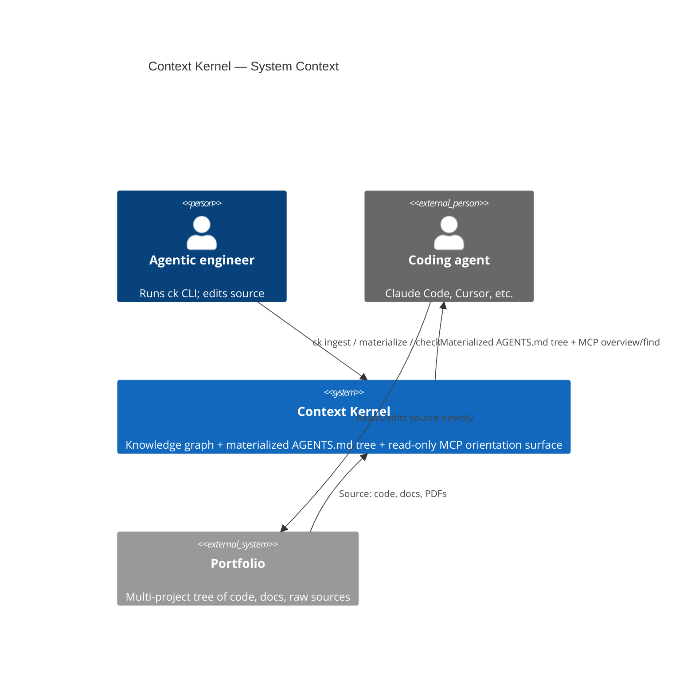

# Theory — Context Kernel

The project's working theory. The trunk. Everything else (`CONTEXT.md`, ADRs, specs) hangs off this.

This document is for the engineer's theory, not the visitor's understanding. Read it expecting a falsifiable claim, not a pitch.

## Thesis

I believe that, as an agentic engineer building my portfolio, context at one altitude doesn't compose into context at another — from cross-project patterns down to an individual Python file — so the agents I use are limited in the context they hold. Therefore I am building a Context Kernel, shaped like a knowledge graph as the source of truth with markdown views the agent walks, because graphs relate the data together from both ends of the altitude tree.

## Shape

Context Kernel sits between a portfolio of projects and the coding agents working over it. A knowledge graph — derived from the portfolio's code and docs by an ingestion pass — is the source of truth. A materialization pass projects the graph into a tree of markdown files (`AGENTS.md` at every scope plus cross-cutting views under `.context-kernel/views/`) that agents read via `Read`/`Grep`/`Glob`. A narrow read-only MCP server (`overview`, `find`) points agents at the right materialized files for orientation queries. A `pre-commit` git hook runs `ck ingest && ck materialize` before every commit, so materialized documentation is always committed in sync with the source that produced it. Documentation travels with the code through branches and merges.

## Invariants

1. **The graph is the source of truth.** All materialized files (`AGENTS.md` tree, `.context-kernel/views/`) are derived from the graph by `ck materialize` and are never written by any other code path. Future MCP write tools (if added) mutate the graph and trigger materialization — they don't edit materialized files in place.

2. **Materialized files are committed in sync with their source.** A `pre-commit` git hook regenerates documentation before every commit; materialized files are version-controlled alongside code. The staleness window is bounded by commit frequency — uncommitted edits are not reflected until the next commit.

3. **The MCP server is stateless and performs no runtime synthesis.** Reads return pre-materialized content — no live LLM calls, no on-the-fly graph traversal in the request path. Write tools, if added, obey invariant 1.

4. **Derived artifacts are content-addressed and immutable.** Embeddings, summaries, and any other deterministically-derivable file is stored at `<sha256>(input).<ext>` and never mutated in place.

## Non-goals

- **No hand-edits to materialized files as source of truth.** Free-form edits outside `<!-- pinned -->` blocks are overwritten on the next materialization without warning. The graph is authoritative; markdown is the view.

- **No cross-project entity merging in v1.** Per-project entity namespaces only. If two projects both define an entity called `User`, they remain distinct in the graph. Cross-project linking is deferred until natural seams emerge from real use.

- ~~**No cloud LLM fallback.**~~ Resolved: DeepSeek V4 Flash (summarizer) and Cloudflare Workers AI (embedder) are supported alongside local GPU. Config-driven via `.context-kernel/config.toml`. See session notes 2026-05-27.

- **No daemon or file-watcher regeneration.** Regeneration is event-driven via a git `pre-commit` hook — no background process, no inotify, no runtime freshness gate. Trade-off is that uncommitted edits are not reflected in materialized files until the next commit; acceptable because regular git usage throughout the day keeps documentation fresh.

- **No eval harness in v1.** No automated benchmark of "did the agent get a better answer because Context Kernel was in the loop." Demoability and self-dogfooding are the v1 success bar.

## Candidate thesis expansion — product category (proposed 2026-05-29, not yet adopted)

Recorded as the north-star product category this line of work is circling, **not** adopted into the
Thesis above. Working notes in `THOUGHTS.md` (scratch). Promote to the Thesis — with a revision-log
entry — only once measured.

> **The Context Kernel is the externalized, queryable theory of the codebase** — the engineer's
> conceptual model made into a graph, indexed by the concepts you care about, kept in sync at commit
> time, so any question posed in concepts resolves to precise code without search or synthesis.

This sharpens the current thesis ("context at one altitude doesn't compose into another") onto a
**second, orthogonal axis**:

- **Structural axis (containment):** portfolio ⊃ project ⊃ scope ⊃ file ⊃ symbol — derived
  deterministically from AST + code-anchoring (ADR-0017). Answers *what is in here*.
- **Conceptual axis (aspect):** concepts that cross-cut the structural tree at whatever altitude
  their instances appear. A concept's scope is the **emergent span of its edges**, not a fixed tier
  (correcting an earlier "concepts are portfolio-scoped" mis-step). Answers *where does this concern
  live*.

Two kinds of concept, different grounding, different edge semantics:

- **entity-concept** (a step-panel, a session): a symbol *is* an instance → `implemented-by` →
  groundable deterministically against a curated alias list.
- **aspect-concept** (concurrency, error-handling, security): a symbol *participates in* it →
  `participates-in` → never named in code (no `class Concurrency`), so populated by **interpretive
  classification at ingest**, not name-match or cosine.

Implies a third query primitive beside `overview`/`find`: **`resolve-concept`** — return a concept
node's neighbors, pre-materialized (honors invariant 3, no runtime LLM/cosine). Ties to the Naur
foundation (`docs/adr/`): the concept→code map *is* the program's theory — it lives in the
engineer's head and nowhere in the code; this externalizes it.

Load-bearing risks: (1) the ontology is a curated, finite, operator-maintained artifact (you index
what you query repeatedly, not all of meaning) and becomes a **new rot surface**; (2) **annotations
must never be load-bearing** — if a concern is findable only because someone hand-tagged it, this
collapses into a comment-convention linter that `grep` + discipline already approximates. The bet is
that *deriving* the map mechanically beats letting human tagging discipline rot.

**Why the conceptual axis is what bridges languages (the mechanism — [ADR-0018](./docs/adr/0018-evidence-anchored-concept-edges.md)).**
Code-anchoring (ADR-0017) relates code to code, but the implementation of a problem in TypeScript, Python, or C# is mechanically
different — the *only* thing that relates them is the concept. ADR-0018 makes that concrete: a concept
node stays **language-neutral**, while its evidence is a set of **CodeSpans** — the precise source
lines (a `asyncio.Lock` here, a `Mutex`/`Promise.all` there) that instantiate it. The spans are
exactly where language-specificity lives and where the bridge attaches: the concept is the joint,
the spans are language-specific legs, and they are *allowed* to look nothing alike because they are
leaves, not the joint. This is the answer to "what mechanically relates a frontend `StepPanel` and a
backend one" — not shared code, but shared concept with per-language evidence. It also restates risk
(2) as a property: a span is *derived* from source (delete the primitive, the span and the membership
it justified decay), so the bridge can never silently rot into a hand-tag.

## Open questions

- **Does cross-project insight surfacing require entity merging?** Non-goal (2) defers entity merging to v2. If view-based surfacing (e.g. `by-topic/auth.md` listing every scope tagged `auth` across projects) is enough to deliver cross-project context, the deferral is fine. If real cross-project insight requires unifying entities (recognizing that `Customer` in project-a and `User` in project-b are the same concept), then v2 is doing thesis-level work, and v1 isn't actually testing the thesis — it's testing a single-project version of it. Future ADR.

- **Is "scope" coterminous with "directory"?** Today the materialization model maps one `AGENTS.md` per directory. But `src/auth/` and `docs/auth-design.md` are arguably the same logical scope. If scopes need to span or arbitrarily group directories, the graph schema and navigation model change. Future ADR (probably triggered by concrete pain).

- ~~**Does pull-based JIT regeneration survive real first-read latency?**~~ Resolved: replaced pull-based JIT with pre-commit hook regeneration. Latency moves from the agent's read path to the developer's commit path, where a few seconds is acceptable. See ADR-0010.

- **Should `.context-kernel/` be committed to git?** Materialized files (`AGENTS.md`, `CLAUDE.md` bridge) are committed. But `.context-kernel/` also contains the graph state, content-addressed embeddings, and summaries. Committing them adds portability (clone gives you the full knowledge graph — vector search, knowledge queries without rebuilding locally) and extensibility (CI pipelines, collaborators, web UIs can consume the graph). Trade-off is repo size and potential merge complexity on graph state. Content-addressed blobs are merge-friendly by nature (same content = same filename). Deferred until we see actual sizes after S1 E2E.

- **Should Ousterhout's module model be encoded as first-class graph structure?** v1 surfaces Ousterhout signals (interface/internals split, depth metrics, protocol relationships) as structured text in handler chunks — the Summarizer interprets them and they flow through `Entity.description` into materialized files. If this proves insufficient (e.g., agents need to query "show me all shallow modules" or "which modules implement Protocol X"), the graph schema itself may need interface/depth/seam fields on Entity, and the Materializer may need Ousterhout-aware templates. Trade-off: first-class encoding gives structured queryability but couples the graph schema to a specific design vocabulary; text-in-description is looser but sufficient if orientation summaries are the primary consumer. Future ADR, triggered by real dogfooding pain.

- **Should entities carry a confidence score across spatial, temporal, authority, and centrality axes?** Today the graph treats all entities as equally weighted. But a code entity from AST parsing is always current; a doc entity from a stale handoff note may contradict the code. The document hierarchy in CLAUDE.md already defines authority tiers by shelf-life. Git timestamps provide temporal freshness. Graph topology reveals centrality (how many other entities depend on this one). And the entity extractor currently operates without context — it doesn't see code state or canonical vocabulary when processing doc chunks, so stale or inconsistently-named entities enter the graph unchecked. The HANDOFF.md incident (2026-05-27) — where a stale doc entity poisoned the ROOT summary — is the motivating failure. Two ADRs address complementary aspects: [ADR-0015](./docs/adr/0015-entity-confidence-scoring.md) (confidence scoring after extraction) and [ADR-0016](./docs/adr/0016-contextual-entity-extraction.md) (contextual grounding during extraction).

- **Does LightRAG's entity extraction surface cross-scope relationships at sufficient density?** Cross-scope orientation — *what does this scope depend on elsewhere in the portfolio?* — is what makes Context Kernel different from a flat vector RAG. Per [ADR-0009](./docs/adr/0009-cross-scope-relationships-via-source-id.md), the mechanism is LightRAG's native cross-document entity merging plus a source-ID traversal post-pass. It only works if LightRAG reliably merges the same logical entity across files with inconsistent surface naming (`Customer` vs `customer entity` vs `CustomerEntity`). On a real portfolio corpus, does the resulting graph have a non-sparse set of relationships whose endpoints span ≥2 scopes? Measurement required in S0 (per S0 exit criterion); heuristic thresholds — ≥15% = go, <5% = stop and re-grill [ADR-0004](./docs/adr/0004-switch-to-lightrag.md), 5-15% = limp forward with caveat. **This is the thesis-load-bearing open question for v1**: if cross-scope linkage fails on this backend, the implementation is wrong and possibly the architecture is too. Resolved by either confirming the density or pivoting the backend.

## Revision log

Dated entries when the **thesis** shifts. Not every edit. Not glossary refinements (those live in `CONTEXT.md`). Not decisions (those live in ADRs).

- **2026-05-23** — Initial draft. Context Kernel: a knowledge graph + materialized markdown views that composes context across altitudes, so agents at any level of the portfolio can navigate from cross-project patterns down to individual files.
- **2026-05-24** — Invariant 2 shift: replaced pull-based JIT freshness gate with pre-commit git hook regeneration. Documentation is now a committed artifact that travels with the code, not a runtime-gated read. Supersedes ADR-0003.
