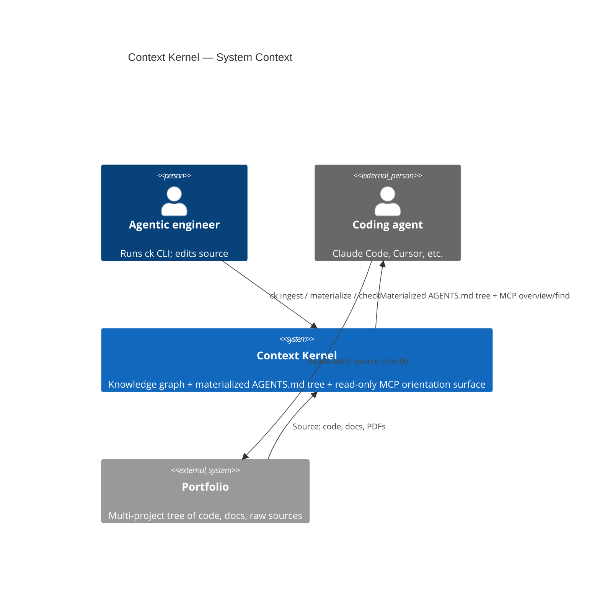

# Theory — Context Kernel

The project's working theory. The trunk. Everything else (`CONTEXT.md`, ADRs, specs) hangs off this.

This document is for the engineer's theory, not the visitor's understanding. Read it expecting a falsifiable claim, not a pitch.

## Thesis

I believe that, as an agentic engineer building my portfolio, context at one altitude doesn't compose into context at another — from cross-project patterns down to an individual Python file — so the agents I use are limited in the context they hold. Therefore I am building a Context Kernel, shaped like a knowledge graph as the source of truth with markdown views the agent walks, because graphs relate the data together from both ends of the altitude tree.

## Shape

Context Kernel sits between a portfolio of projects and the coding agents working over it. A knowledge graph — derived from the portfolio's code and docs by an ingestion pass — is the source of truth. A materialization pass projects the graph into a tree of markdown files (`AGENTS.md` at every scope plus cross-cutting views under `.context-kernel/views/`) that agents read via `Read`/`Grep`/`Glob`. A narrow read-only MCP server (`overview`, `find`) points agents at the right materialized files for orientation queries. A freshness gate before every read guarantees the agent cannot receive a stale chunk.

## Invariants

1. **The graph is the source of truth.** All materialized files (`AGENTS.md` tree, `.context-kernel/views/`) are derived from the graph by `ck materialize` and are never written by any other code path. Future MCP write tools (if added) mutate the graph and trigger materialization — they don't edit materialized files in place.

2. **No materialized file is ever served stale.** Every read (file or MCP) verifies the freshness header against current graph and source-tree state; regenerates before returning if mismatched.

3. **The MCP server is stateless and performs no runtime synthesis.** Reads return pre-materialized content — no live LLM calls, no on-the-fly graph traversal in the request path. Write tools, if added, obey invariant 1.

4. **Derived artifacts are content-addressed and immutable.** Embeddings, summaries, and any other deterministically-derivable file is stored at `<sha256>(input).<ext>` and never mutated in place.

## Non-goals

- **No hand-edits to materialized files as source of truth.** Free-form edits outside `<!-- pinned -->` blocks are overwritten on the next materialization without warning. The graph is authoritative; markdown is the view.

- **No cross-project entity merging in v1.** Per-project entity namespaces only. If two projects both define an entity called `User`, they remain distinct in the graph. Cross-project linking is deferred until natural seams emerge from real use.

- **No cloud LLM fallback.** All summarization and embedding runs locally on the 7900 XTX. A seam exists in the `Summarizer` / `Embedder` interfaces but is not filled.

- **No push-based / file-watcher regeneration.** Regeneration is pull-based and JIT — triggered on read, not on source change. No daemon, no inotify. Trade-off is first-read latency, which is acceptable and measurable.

- **No eval harness in v1.** No automated benchmark of "did the agent get a better answer because Context Kernel was in the loop." Demoability and self-dogfooding are the v1 success bar.

## Open questions

- **Does cross-project insight surfacing require entity merging?** Non-goal (2) defers entity merging to v2. If view-based surfacing (e.g. `by-topic/auth.md` listing every scope tagged `auth` across projects) is enough to deliver cross-project context, the deferral is fine. If real cross-project insight requires unifying entities (recognizing that `Customer` in project-a and `User` in project-b are the same concept), then v2 is doing thesis-level work, and v1 isn't actually testing the thesis — it's testing a single-project version of it. Future ADR.

- **Is "scope" coterminous with "directory"?** Today the materialization model maps one `AGENTS.md` per directory. But `src/auth/` and `docs/auth-design.md` are arguably the same logical scope. If scopes need to span or arbitrarily group directories, the graph schema and navigation model change. Future ADR (probably triggered by concrete pain).

- **Does pull-based JIT regeneration survive real first-read latency?** Non-goal (4) commits to pull-based. If regenerating a large unseen scope takes 60+ seconds on the agent's first read, the agent UX collapses and the architectural choice is wrong. Thesis survives — implementation doesn't. Measurement needed in the first 3 days of v1 work; resolved by either accepting the budget or flipping to push-based (which would invalidate Non-goal 4).

- **Does LightRAG's entity extraction surface cross-scope relationships at sufficient density?** Cross-scope orientation — *what does this scope depend on elsewhere in the portfolio?* — is what makes Context Kernel different from a flat vector RAG. Per [ADR-0009](./docs/adr/0009-cross-scope-relationships-via-source-id.md), the mechanism is LightRAG's native cross-document entity merging plus a source-ID traversal post-pass. It only works if LightRAG reliably merges the same logical entity across files with inconsistent surface naming (`Customer` vs `customer entity` vs `CustomerEntity`). On a real portfolio corpus, does the resulting graph have a non-sparse set of relationships whose endpoints span ≥2 scopes? Measurement required in S0 (per [HANDOFF.md](./HANDOFF.md) S0 exit criterion); heuristic thresholds — ≥15% = go, <5% = stop and re-grill [ADR-0004](./docs/adr/0004-switch-to-lightrag.md), 5-15% = limp forward with caveat. **This is the thesis-load-bearing open question for v1**: if cross-scope linkage fails on this backend, the implementation is wrong and possibly the architecture is too. Resolved by either confirming the density or pivoting the backend.

## Revision log

Dated entries when the **thesis** shifts. Not every edit. Not glossary refinements (those live in `CONTEXT.md`). Not decisions (those live in ADRs).

- **2026-05-23** — Initial draft. Context Kernel: a knowledge graph + materialized markdown views that composes context across altitudes, so agents at any level of the portfolio can navigate from cross-project patterns down to individual files.
